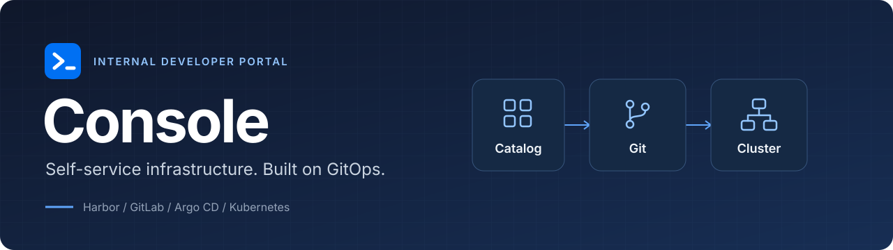
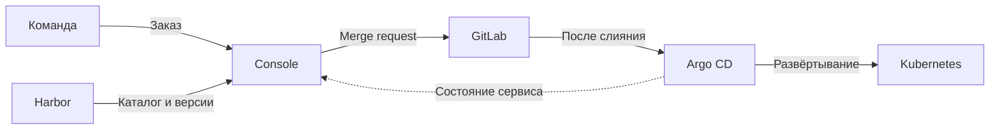

<p align="center">
  
</p>

<p align="center">
  <strong>Сервисы для команд через единый каталог.</strong><br>
  Заказывайте, настраивайте и обновляйте инфраструктуру в портале.<br>
  Изменения проходят через Git, развёртыванием управляет Argo CD.
</p>

<p align="center">
  <a href="https://github.com/awbait/console/actions/workflows/ci.yml"></a>
  <a href="https://github.com/awbait/console/releases"></a>
  <a href="LICENSE.md"></a>
</p>

<p align="center">
  <a href="#capabilities">Возможности</a> ·
  <a href="#workflow">Как это работает</a> ·
  <a href="#start">Запуск</a> ·
  <a href="#documentation">Документация</a> ·
  <a href="#license">Лицензия</a>
</p>

---

**Console** - внутренний портал разработчика для команд, которые используют
Kubernetes и GitOps. Платформенная команда публикует сервисы на основе Helm-чартов,
а разработчики заказывают нужные экземпляры через форму и управляют ими в одном месте.

Портал связывает каталог, согласование изменений и состояние развёрнутых сервисов.
Настройки хранятся в GitLab, а история заказа показывает действия участников
и результат развёртывания.

> **Бесплатно для внутренних задач компании.** Исходный код доступен для изучения
> и доработки; продажа копий и предоставление платного доступа третьим лицам
> не разрешены этой лицензией. [Условия использования ↓](#license)

<a id="capabilities"></a>

## От заказа до сопровождения

| Для разработчиков | Для платформенной команды |
| :--- | :--- |
| **Каталог сервисов.** Доступные версии, описание и документация в одном месте. | **Публикация версий.** Подготовка формы заказа и согласование перед появлением версии в каталоге. |
| **Заказ через форму.** Поля, подсказки и проверка параметров; YAML-редактор для работы с настройками напрямую. | **Конструктор форм.** Настройка формы и карточки сервиса по схеме Helm-чарта. |
| **Управление сервисом.** Изменение параметров, переход на новую версию и удаление со страницы заказа. | **Работа с Git.** Обнаружение расхождений, загрузка актуальных настроек и импорт существующих сервисов. |
| **Состояние и история.** Ход развёртывания, ошибки и уведомления об изменениях. | **Поддержка и ИБ.** Обзор заказов всех команд, согласование политик и контроль нарушений. |

Доступ к действиям определяется ролью и командами пользователя в Keycloak.
Поддержка, информационная безопасность и администраторы работают в своих разделах.

<details>
<summary><strong>Посмотреть интерфейс: поддержка и конструктор форм</strong></summary>

### Поддержка

Общая картина по заказам команд помогает находить сервисы, требующие внимания.


### Конструктор форм

Форма заказа и карточка сервиса настраиваются для каждой версии чарта.


</details>

<a id="workflow"></a>

## Как это работает

1. **Выберите сервис и версию.** Каталог показывает опубликованные сервисы из Harbor.
2. **Заполните параметры.** Портал проверит значения и создаст merge request в GitLab.
3. **Дождитесь применения.** После слияния изменений Argo CD развернёт сервис в кластере.
4. **Управляйте сервисом.** Состояние, настройки и история доступны на странице заказа.



### Компоненты

Портал поставляется как Go-приложение со встроенным веб-интерфейсом на React.
Для работы нужны следующие системы:

| Система | Назначение |
| :--- | :--- |
| **Harbor** | Helm-чарты, версии, схемы параметров и документация сервисов. |
| **GitLab** | GitOps-репозитории команд и merge request с изменениями. |
| **Argo CD** | Развёртывание в Kubernetes и состояние приложений. |
| **Keycloak** | Вход, группы пользователей, роли и принадлежность к командам. |
| **PostgreSQL** | Заказы, публикации и история действий. |
| **Valkey / Redis** | Сессии и кеш. |

<a id="start"></a>

## Запуск для разработки

Console использует настоящие Harbor, GitLab и Argo CD; для локального запуска
нужны доступные экземпляры этих систем и их параметры подключения.

### Локальный стенд на Windows

Подготовьте Docker Desktop, PowerShell, Go 1.26.1 или новее, Bun 1.x, Git, Make,
kubectl, Helm и KinD. Требования и настройка стенда описаны в
[инструкции KinD](deployments/kind/README.md).

```powershell
git clone https://github.com/awbait/console.git
cd console

make stand-up
make up-upstreams-infra
```

Дождитесь состояния `healthy` у GitLab, затем подготовьте его группы и токен:

```powershell
docker compose -f deployments/docker-compose.yml -f deployments/docker-compose.upstreams.yml ps
make gitlab-seed
```

Запустите backend и frontend **в двух отдельных терминалах**:

```powershell
# Терминал 1
powershell -File deployments/scripts/run-oidc.ps1
```

```powershell
# Терминал 2
make web
```

Откройте [localhost:5173](http://localhost:5173) и войдите через Keycloak.
Учётные записи локального стенда: `alice` / `alice` для разработчика,
`padmin` / `padmin` для администратора.

Сервисы появляются в каталоге после загрузки и публикации чартов.
Для загрузки собственных чартов в Harbor стенда задайте `STAND_CHARTS_DIR`
и выполните `make stand-charts`; подробнее в [инструкции стенда](deployments/kind/README.md).

<details>
<summary><strong>Запуск с существующими Harbor, GitLab и Argo CD</strong></summary>

Скопируйте [`.env.example`](.env.example) в `.env`, заполните адреса и токены
Harbor, GitLab и Argo CD. Для окружения с POSIX-оболочкой доступны команды:

```sh
make infra
make run-oidc
```

Во втором терминале выполните `make web`. Команда `make run-oidc` использует
локальные PostgreSQL, Valkey и Keycloak из Docker Compose, а адреса внешних
Harbor, GitLab и Argo CD читает из `.env`.

Для автоматического перезапуска backend установите
[Air](https://github.com/air-verse/air) и используйте `make watch`.
Windows-скрипт `run-oidc.ps1` подхватывает установленный Air автоматически.

</details>

<a id="documentation"></a>

## Документация

Пользовательские инструкции также доступны в разделе «Документация» внутри портала.

| Задача | Материалы |
| :--- | :--- |
| Начать пользоваться | [Первый заказ](web/public/docs-content/quick-start.md) · [Заказ сервиса](web/public/docs-content/ordering.md) |
| Добавить сервис в каталог | [Публикация](web/public/docs-content/publishing.md) · [Конвенция чартов](docs/chart-convention.md) |
| Настроить интерфейс сервиса | [Конструктор формы заказа](web/public/docs-content/view-document.md) |
| Настроить доступ | [Роли и команды](web/public/docs-content/roles.md) |
| Сопровождать платформу | [Поддержка](web/public/docs-content/support.md) · [Информационная безопасность](web/public/docs-content/security.md) |
| Разобраться в устройстве | [Спецификация](docs/idp-spec.md) · [Структура Git](web/public/docs-content/git-structure.md) |
| Посмотреть изменения | [Журнал изменений](CHANGELOG.ru.md) · [Релизы](https://github.com/awbait/console/releases) |

<a id="license"></a>

## Лицензия

Console распространяется по **[Sustainable Use License 1.0](LICENSE.md)**.
Это модель **source-available**: исходный код доступен, а использование
ограничено условиями лицензии.

| Сценарий | Условия |
| :--- | :--- |
| Установить портал для внутренних задач своей компании | Разрешено бесплатно. |
| Изучать и изменять код для внутренних задач, личного или некоммерческого использования | Разрешено. |
| Передавать исходную или изменённую версию другим | Только бесплатно и для некоммерческих целей, с сохранением лицензии и уведомлений; изменения нужно обозначить. |
| Продавать копии портала, включая изменённые версии | Не разрешено этой лицензией. |
| Предоставлять третьим лицам платный доступ к порталу | Не разрешено этой лицензией. |

Таблица поясняет основные условия; полный текст находится в [LICENSE.md](LICENSE.md).
Сторонние компоненты сохраняют собственные лицензии.

Текст Sustainable Use License разработан [n8n](https://blog.n8n.io/announcing-new-sustainable-use-license/).
