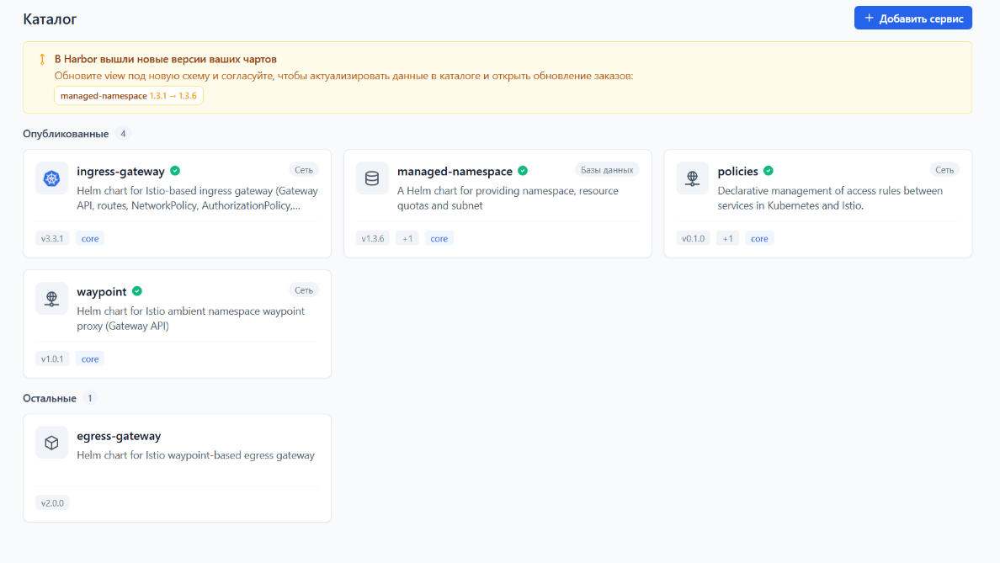
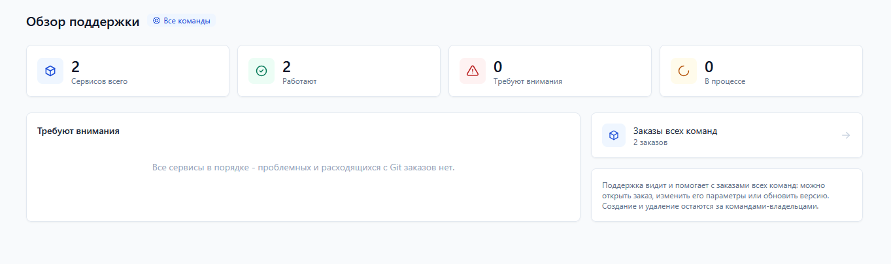
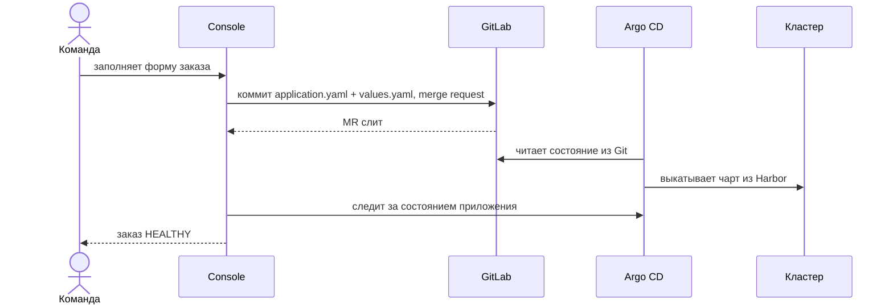

<h1 align="center">Console</h1>

<p align="center">
  <strong>Внутренний портал разработчика над GitOps.</strong><br>
  Команды сами заказывают managed-сервисы через каталог, а платформа остаётся в Git.
</p>

<p align="center">
  <a href="https://github.com/awbait/console/actions/workflows/ci.yml"></a>
  <a href="https://github.com/awbait/console/releases"></a>
  
  
</p>

<p align="center">
  
</p>

## Зачем

Заказ managed-сервиса обычно выглядит как заявка в поддержку: команда описывает,
что ей нужно, инженер платформы руками готовит манифесты, кто-то это ревьюит,
кто-то выкатывает. Дни ожидания, разные результаты у разных инженеров и никакого
следа, кроме переписки.

Console превращает это в самообслуживание, ничего не ломая в GitOps: заказ из
формы становится merge request в Git, Argo CD приводит кластер к описанному
состоянию, а портал ведёт сервис до готовности и дальше - через обновления,
изменения и вывод из эксплуатации. Git остаётся источником истины, портал -
витриной и регламентом.

Кому это нужно:

- **Командам разработки** - заказать сервис за минуты и видеть его состояние, не
  разбираясь в Helm, Argo CD и структуре GitOps-репозитория.
- **Платформенной команде** - один стандартный путь вместо десятка ручных, с
  согласованием того, что попадает в каталог.
- **Поддержке и ИБ** - общая картина по всем командам: проблемные сервисы,
  расхождения с Git, согласование политик.

## Возможности

### Каталог и заказ

Каталог собирается из чартов в Harbor: описание, версии, README, CHANGELOG,
values и схема - всё из самого артефакта. Форма заказа строится по
`values.schema.json`, поэтому новый сервис не требует правок в портале; рядом -
сырой YAML в Monaco для тех, кому так быстрее. Сервис публикуется версия за
версией: у каждой своя форма и своё согласование.

### Жизненный цикл сервиса

Заказ проходит путь `DRAFT -> MR_CREATED -> MR_MERGED -> DEPLOYING -> HEALTHY`;
состояние обновляется поллером и приезжает в интерфейс по SSE, без перезагрузки
страницы. История заказа читается как список событий с именами тех, кто
действовал.

### Обратная синхронизация с Git

Git правят и мимо портала - это нормально, и портал это учитывает: детект дрейфа
отмечает разошедшиеся заказы, «Подтянуть из Git» переносит состояние Git в
портал, импорт подбирает манифесты, созданные напрямую.

### Поддержка и информационная безопасность

Поддержка видит заказы всех команд и помогает с ними, не будучи владельцем. Для
ИБ - согласование сетевых политик и карта взаимодействия сервисов, из которой
заказ политик собирается прямо на месте.

<p align="center">
  
</p>

### Видимое состояние платформы

Портал стоит перед четырьмя внешними системами и не молчит, когда одна из них
падает: значок в верхней панели говорит, что работает, а что нет, действия,
которые сейчас не пройдут, выключены с пояснением, а администратору доступны
состояние каждого компонента и вся конфигурация запуска.

## Архитектура


Портал - один Go-бинарь с тремя доменами (каталог, провижининг, статус) и вшитым
SPA. Своего состояния кластера он не держит:

| Система | Роль |
|---|---|
| **Harbor** | реестр чартов: каталог, версии, values, схемы |
| **GitLab** | GitOps-репозитории команд, merge request на каждое изменение |
| **Argo CD** | выкатка чартов в кластер и фактическое состояние сервисов |
| **Keycloak** | вход и группы, из которых выводятся роли и команды |
| **PostgreSQL** | заказы, публикации, категории |
| **Valkey / Redis** | сессии и кеш файлов чартов |

Как проходит заказ:



Подробнее - [спецификация](docs/idp-spec.md) и
[конвенция чартов](docs/chart-convention.md).

## Быстрый старт

Портал работает только с настоящими Harbor, GitLab и Argo CD, поэтому локальный
запуск начинается со стенда:

```sh
make stand-up             # KinD: Argo CD + Harbor (Windows/PowerShell)
make up-upstreams-infra   # Postgres + Valkey + Keycloak + GitLab CE
make gitlab-seed          # GitOps-группы и токен портала
```

Дальше портал и фронтенд запускаются из исходников, с live-reload:

```sh
powershell -File deployments/scripts/run-oidc.ps1   # портал на :8080
make web                                            # SPA на :5173
```

Портал перезапускается на каждое изменение сам, если установлен
[air](https://github.com/air-verse/air) (`go install github.com/air-verse/air@latest`).
На Linux и macOS то же самое делает `make watch`.

Открыть **http://localhost:5173** и войти через Keycloak (`alice` / `alice` -
обычная команда, `padmin` / `padmin` - администратор платформы).

Полный порядок, требования и разбор стенда - в
[docs/development.md](docs/development.md) и
[deployments/kind/README.md](deployments/kind/README.md).

## Технологии

**Backend:** Go, chi, pgx, OIDC (Keycloak), Prometheus, SSE.
**Frontend:** React 19, React Aria Components, Tailwind, Monaco, React Flow,
TanStack Query, Vite, bun.
**Инфраструктура:** PostgreSQL, Valkey, Docker, Helm, Argo CD, Harbor, GitLab.

## Документация

| Документ | О чём |
|---|---|
| [Спецификация](docs/idp-spec.md) | домены, API, модель данных, RBAC |
| [Разработка](docs/development.md) | локальный запуск, стенд, структура репозитория |
| [Наблюдаемость](docs/observability.md) | метрики, логи, дашборд Grafana |
| [Конвенция чартов](docs/chart-convention.md) | что портал ждёт от чарта в Harbor |
| [Несколько версий сервиса](docs/multi-version-publications.md) | публикация версия за версией |
| [Польза и экономия](docs/value-and-savings.md) | аргументация и методика расчёта эффекта |
| [Журнал изменений](CHANGELOG.ru.md) | что появилось в каждой версии |

Пользовательская документация встроена в сам портал - раздел «Документация» в
меню.
