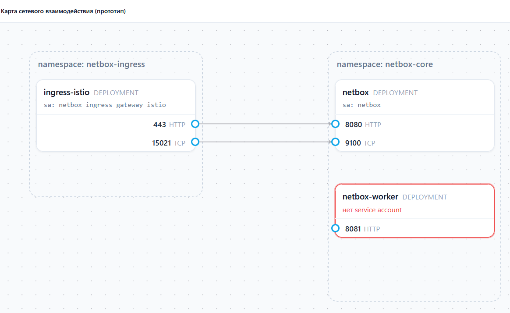

# Policies

Политики задают правила доступа и ограничения трафика между сервисами платформы.

> [!WARNING]
> Раздел в разработке. Состав политик и их параметры будут уточнены.

## Назначение

Заглушка. Что описывают политики и на что они влияют.

## Параметры заказа

Заглушка. Описание полей формы (источники, назначения, действия).

## Карта сетевого взаимодействия

Прототип визуального редактора: карта показывает namespace-ы, их deployment-ы с service account-ами и открытые порты, а связи между портами отражают разрешённый трафик между сервисами.

> [!NOTE]
> Прототип на моковых данных. Deployment без service account подсвечивается как проблемный (красная рамка).
