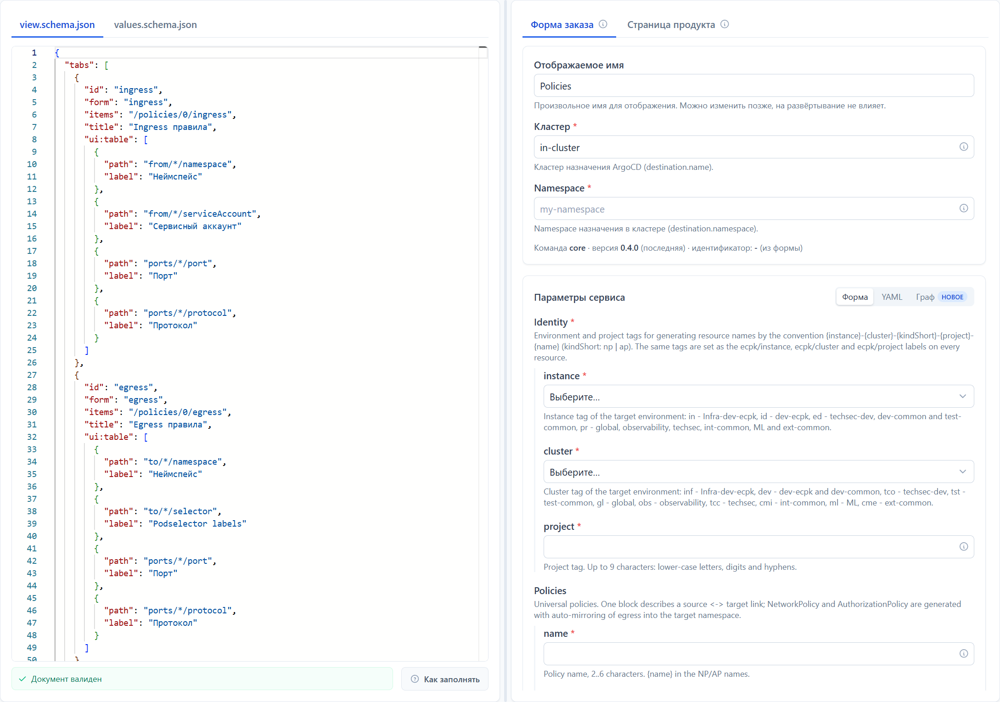
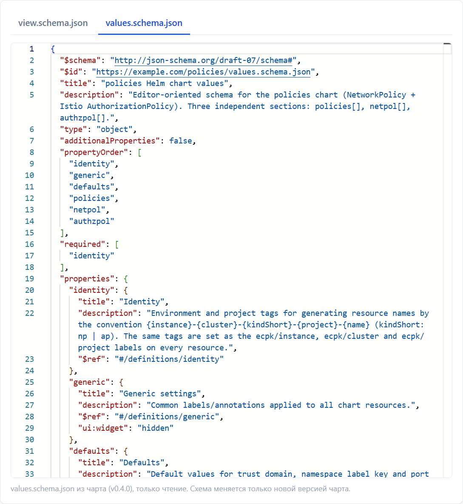
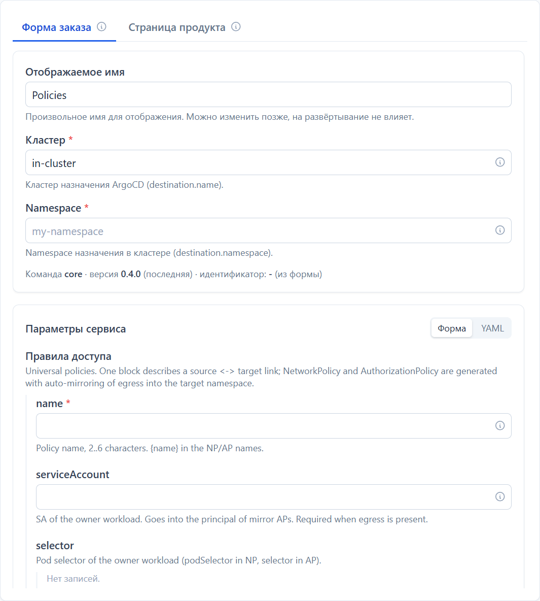
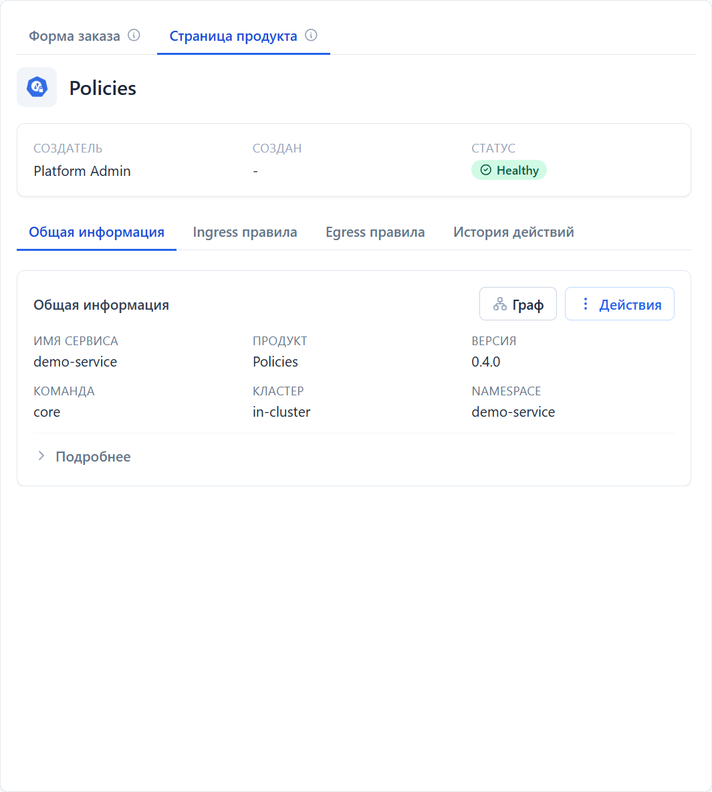
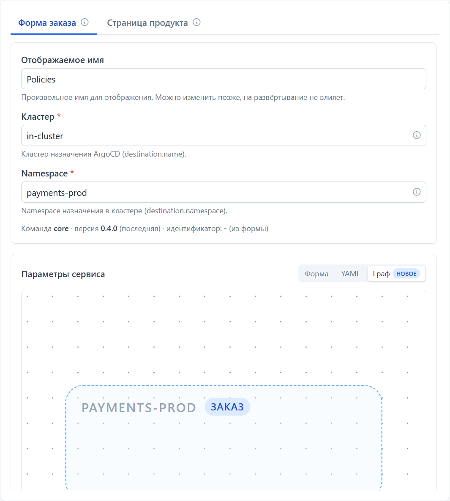
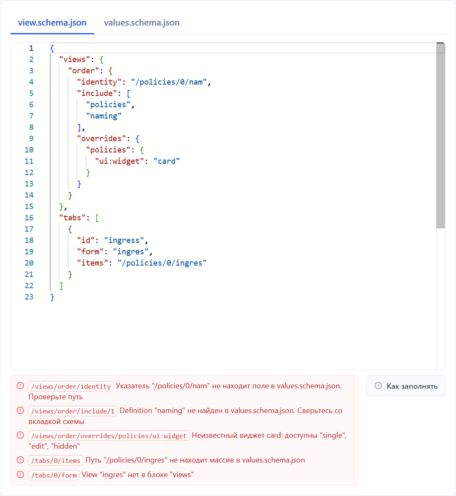

# Конструктор формы заказа

У каждой версии сервиса есть свой документ - `view.schema.json`. Он решает, что увидит заказчик: какие поля показать в форме заказа, как их назвать и сгруппировать, какие вкладки и действия появятся на странице уже работающего сервиса.

Страница для владельца сервиса: того, кто публикует чарт в каталоге. Заказчику ничего из этого знать не нужно, он видит только готовую форму.

Документ ничего не описывает сам по себе. Поля, их типы, значения по умолчанию и подсказки живут в схеме чарта (файл `values.schema.json`), а документ версии только выбирает из них нужные и переставляет. Поэтому он короткий: чаще всего это десяток строк.

Дальше по тексту встретятся два слова. **Values** - это настройки сервиса, которые в итоге уезжают в Git и попадают в кластер: то самое, что заполняет заказчик. **Указатель** (в примерах он выглядит как `/gateways/0/name`) - это путь до конкретного поля внутри них: от корня, через имена полей, где число означает номер элемента в списке.



Открывается конструктор из каталога: карточка сервиса, кнопка **Управление**, затем **Настроить** или **Изменить** у нужной версии. Слева редактор документа, справа живой предпросмотр. Под редактором портал показывает, валиден ли документ, и перечисляет ошибки с указанием места.

## Два документа

Слева в конструкторе две вкладки, и путать их не нужно.

| Документ | Кто пишет | Что в нём |
|---|---|---|
| `values.schema.json` | автор чарта | все поля сервиса, их типы, подписи и требования |
| `view.schema.json` | владелец сервиса в портале | какие из этих полей показать и как |

Схема чарта в конструкторе доступна только для чтения: она приезжает вместе с версией из реестра и меняется только новой версией чарта. Именно оттуда берутся имена, которые вы пишете в документе версии.



В примере выше у чарта верхние поля `identity`, `generic`, `defaults`, `policies`, `netpol`, `authzpol`. Это те имена, которые можно перечислять в `include` и `exclude`.

> [!TIP]
> Подписи и описания полей форма берёт из `title` и `description` схемы чарта. Если подпись плохая, лучше исправить её в чарте, а не переписывать в документе версии: тогда она станет правильной сразу везде.

## Минимальный документ

Обязателен один блок - `views`, и в нём одна view с именем `order`. Это форма нового заказа.

```json
{
  "views": {
    "order": {
      "identity": "/policies/0/name",
      "include": ["policies"],
      "overrides": {
        "policies": {
          "title": "Правила доступа",
          "ui:widget": "single",
          "ui:view": { "exclude": ["enabled"] }
        }
      }
    }
  }
}
```



Что здесь произошло:

- `include` оставил в форме одно поле чарта из шести;
- `title` переименовал его в «Правила доступа»;
- `ui:widget: "single"` показал список из одного элемента как обычный блок полей, без кнопок «Добавить» и «Удалить»;
- `ui:view` с `exclude` убрал поле `enabled` внутри этого блока.

## Разделы документа

На верхнем уровне допустимы только эти ключи.

| Ключ | Обязателен | Зачем |
|---|---|---|
| `views` | да | библиотека форм, среди них обязательная `order` |
| `tabs` | нет | вкладки-таблицы на странице заказанного сервиса |
| `actions` | нет | пункты меню «Действия» на странице сервиса |
| `defaults` | нет | значения, которые портал проставляет за заказчика |
| `graph` | нет | визуальный редактор values вместо формы |
| `approval` | нет | требование, чтобы изменения сливал человек |
| `version` | нет | зарезервировано, портал его не читает |

Ключ `$comment` можно положить рядом с любым из них и внутрь view: это место для заметки самому себе, портал его игнорирует.

## views: библиотека форм

`views` - это набор форм. Одна из них особенная, остальные равноправны.

- **`order`** - форма нового заказа. Она обязательна и должна быть ровно одна.
- Остальные views сами по себе нигде не появляются. View становится видимой, только когда на неё ссылается вкладка (`tabs[].form`) или пункт меню (`actions[].view`). View, на которую никто не ссылается, просто не используется.

Внутри view доступны шесть ключей.

### include и exclude: какие поля показать

Оба принимают массив имён полей верхнего уровня из схемы чарта.

```json
{ "include": ["naming", "gateways"] }
```

`include` перечисляет поля, которые останутся, и **задаёт их порядок** в форме. `exclude` наоборот: оставляет всё, кроме перечисленного, и порядок берёт из схемы чарта. Если не указать ни того, ни другого, форма покажет все поля.

Указывать оба ключа сразу смысла нет: при обоих сработает `include`.

### required: обязательные поля

Массив имён полей, которые форма пометит звёздочкой в дополнение к тем, что уже помечены в схеме чарта. Это подсказка глазу: сам заказ портал от этого строже не проверяет. Настоящую обязательность объявляют в схеме чарта.

### overrides: настройка отдельного поля

Объект «имя поля» -> «настройки». Настройки складываются поверх того, что поле уже говорит о себе в схеме чарта.

```json
{
  "overrides": {
    "gateways": {
      "title": "Шлюзы",
      "description": "Точки входа трафика в ваш сервис",
      "ui:widget": "single",
      "ui:view": { "exclude": ["hpa"] }
    }
  }
}
```

| Настройка | Что делает |
|---|---|
| `title` | подпись поля вместо той, что в схеме чарта |
| `description` | пояснение под подписью |
| `ui:widget` | как поле рисовать, см. ниже |
| `ui:readOnly` | поле показывается, но не редактируется после создания заказа |
| `ui:view` | настройка полей внутри этого поля, тем же набором ключей |

Значения `ui:widget`:

- `"single"` - массив показать как один объект. Подходит там, где чарт технически держит список, но заказывают всегда одну штуку;
- `"hidden"` - поле спрятать вместе с содержимым;
- `"edit"` - наоборот, показать поле, которое схема чарта пометила как `hidden`.

`ui:view` устроена так же, как сама view: внутри снова `include`, `exclude`, `required`, `overrides`. Для объекта она применяется к его полям, для массива - к полям одного элемента. Так описывается вложенность любой глубины.

> [!NOTE]
> `include`, `exclude`, `required` и `overrides` внутри настройки поля работают только внутри `ui:view`. Положенные рядом с `title` они ничего не сделают, и конструктор об этом скажет.

### identity: чем отличать заказы друг от друга

Указатель на поле values, в котором лежит имя разворачиваемого сервиса.

```json
{ "identity": "/gateways/0/name" }
```

По нему портал ловит попытку заказать в один namespace два сервиса с одинаковым именем. Без `identity` именем считается «Имя сервиса» из формы заказа, и это правильный вариант для чартов, у которых поля-имени просто нет.

### namespace: куда разворачивать

Определяет, откуда берётся namespace назначения и показывать ли поле «Namespace» в форме заказа. По умолчанию поле показывается, и его значение и есть namespace.

```json
{ "namespace": { "source": "values", "pointer": "/namespace/namespaceName", "hideOrderField": true } }
```

| `source` | Откуда namespace | Когда так делают |
|---|---|---|
| `"field"` | из поля формы, по умолчанию | обычный сервис, который въезжает в готовый namespace |
| `"values"` | из поля values по `pointer` | чарт сам создаёт namespace и называет его значением |
| `"fixed"` | константа `value` | оператор или сервис уровня кластера, всегда в одном месте |

`hideOrderField: true` убирает поле «Namespace» из формы. Оно работает только с `values` и `fixed`: при `field` прятать нечего, оттуда namespace и берётся.

Строка вместо объекта (`"namespace": "/namespace/namespaceName"`) - старая форма записи. Она означает зеркало: заказчик вводит namespace в форме, а портал дополнительно копирует введённое в это поле values. Для новых документов лучше объект.

## tabs: вкладки заказанного сервиса

Каждая вкладка - это таблица над списком внутри values, с возможностью добавить и изменить элемент.

```json
{
  "tabs": [
    {
      "id": "listeners",
      "title": "Слушатели",
      "items": "/gateways/0/listeners",
      "form": "listener",
      "addLabel": "Добавить слушателя",
      "ui:table": [
        { "path": "name", "label": "Имя" },
        { "path": "port", "label": "Порт" }
      ]
    }
  ]
}
```

| Поле | Обязательно | Что задаёт |
|---|---|---|
| `id` | да | имя вкладки для ссылок из `actions` |
| `title` | нет | заголовок вкладки |
| `items` | да | указатель на список внутри values |
| `form` | да | имя view из `views`, по которой заводят и правят элемент |
| `addLabel` | нет | текст пункта «Добавить ...» |
| `ui:table` | нет | колонки таблицы |
| `enums` | нет | подстановка вариантов в поля формы элемента |

Идентификаторы `info`, `history` и `order` заняты собственными вкладками портала, брать их нельзя. Форма элемента - любая view, кроме `order`: та описывает заказ целиком, а не одну строку списка.

Без `ui:table` вкладка появится, но покажет заглушку: колонки описывать всё равно придётся.



Две вкладки из `tabs` встали рядом с «Общей информацией» и «Историей действий», которые есть у любого заказа. Кнопка **Действия** наполняется из блока `actions`, о нём ниже.

### Колонки

Колонка задаётся одним из двух способов.

**Поле элемента** - `path`, путь внутри элемента через `/`. Сегмент `*` перебирает массив в этом месте и склеивает найденное.

```json
{ "path": "from/*/namespace", "label": "Неймспейс" }
```

**Вычисляемое значение** - `lookup`, когда нужное лежит не в элементе, а в другом списке, и элемент ссылается на него по имени.

```json
{
  "label": "Hostnames",
  "lookup": {
    "keys": "/parentRefs/*/sectionName",
    "in": "/gateways/0/listeners",
    "match": "name",
    "get": "hostname"
  }
}
```

Читается так: собрать ключи по `keys` из элемента, найти в массиве `in` строки, у которых поле `match` равно ключу, и взять из них поле `get`. Для такой колонки `label` обязателен.

### enums: варианты из соседнего списка

Правило наполняет выпадающий список формы элемента значениями из другого места values, чтобы заказчик не вписывал имя руками и не ошибался в нём.

```json
{
  "enums": [
    { "at": "/parentRefs/0/sectionName", "from": "/gateways/0/listeners", "value": "name" }
  ]
}
```

`at` - поле внутри элемента, `from` - массив-источник, `value` - имя поля строки источника, дающее вариант.

## actions: меню «Действия»

Кладёт форму-view пунктом меню на странице заказанного сервиса.

```json
{
  "actions": [
    { "view": "base", "in": "info", "label": "Настройки" }
  ]
}
```

`in` принимает `"info"` (меню вкладки «Общая информация») или `"tab:<id>"` (меню конкретной вкладки из `tabs`). `label` задаёт текст пункта. View `order` в меню класть нельзя.

## defaults: значения без вопросов

Значения, которые портал проставляет в заказ сам, при создании и при обновлении.

```json
{ "defaults": { "/namespace/creator": "console" } }
```

Ключ - указатель на поле values, значение - строка, число или «да/нет». Записанное здесь **перезаписывает** то, что пришло из формы, поэтому раздел годится для полей, спрятанных от заказчика: пометок о происхождении, служебных констант. Указатель ведёт по объектам: индексов массива в нём быть не должно.

### Ссылки на то, что портал знает о заказе

Не всякое значение известно заранее. Команда, автор, неймспейс приходят вместе с заказом, поэтому вместо постоянного значения в строке можно поставить ссылку:

```json
{
  "defaults": {
    "/namespace/owner": "{{.Team}}",
    "/labels/responsible": "{{.User.Name}}",
    "/ingress/host": "{{.ServiceName}}.example.com"
  }
}
```

Ссылка разворачивается при каждой записи заказа. Доступны такие:

| Ссылка | Что подставится |
|---|---|
| `{{.Team}}` | команда, от имени которой сделан заказ |
| `{{.ServiceName}}` | имя сервиса в заказе |
| `{{.Namespace}}` | неймспейс, в который уезжает заказ |
| `{{.Cluster}}` | кластер, в который уезжает заказ |
| `{{.Chart}}` | имя чарта |
| `{{.ChartVersion}}` | версия чарта |
| `{{.User.Name}}` | ФИО автора заказа |
| `{{.User.Subject}}` | идентификатор автора заказа в OIDC |
| `{{.Vars.ИМЯ}}` | переменная платформы, например `{{.Vars.OPS_DOMAIN}}` |

Переменные платформы заводит администратор в разделе «Переменные»: там лежат значения, общие для всех сервисов, вроде домена стенда или имени дежурной команды. Ссылка на переменную, которой нет, не сохранится: документ проверяется по списку заведённых.

Автор - это тот, кто создал заказ, а не тот, кто правит его сейчас. Поэтому ни правка сотрудником поддержки, ни фоновая пересборка изменения не переписывают такое поле на другого человека.

> [!NOTE]
> В ссылке бывает только имя: условий, циклов и функций здесь нет. Опечатка в имени ловится в конструкторе, а не у заказчика: документ с неизвестной ссылкой не сохранится.

Всё, что не начинается с `{{.`, портал не трогает: строка вида `{{ $labels.instance }}` уедет в values как написана. Обратная сторона: оставить `{{.Team}}` в значении текстом, а не ссылкой, не получится.

## graph: заказ рисунком вместо формы

Некоторые сервисы удобнее описывать картинкой, а не списком полей. Блок `graph` включает для этой версии визуальный редактор: в форме заказа рядом с «Форма» и «YAML» появляется вкладка «Граф».

```json
{ "graph": { "profile": "policies" } }
```



Сейчас доступен один редактор - `policies`: правила сетевого доступа рисуются стрелками между namespace. Если чарт называет поля по соглашению, больше ничего писать не нужно. Если иначе - имена переименовываются здесь же:

```json
{
  "graph": {
    "profile": "policies",
    "entries": "/policies",
    "entry": { "selector": "podSelector" },
    "rule": { "ports": "portList" },
    "peer": { "namespace": "ns" }
  }
}
```

`entries` - указатель на список записей, `entry`, `rule` и `peer` переименовывают поля записи, правила и её собеседника. Все они проверяются по схеме чарта, поэтому расхождение видно здесь, а не у заказчика. `enabled: false` выключает редактор, не удаляя настройку.

## approval: изменения через человека

Говорит, что каждое изменение этого сервиса сливает человек.

```json
{ "approval": { "autoMerge": false } }
```

Портал подготовит изменение в Git и остановится, пока его не примет человек. Так делают для сервисов, за которыми смотрит информационная безопасность, например для сетевых политик. Без этого раздела решает настройка портала. Обратное неверно: включить автоматическое слияние там, где его выключили в портале, документ версии не может.

## Ошибки и что они значат

Конструктор проверяет документ на лету и сверяет каждое имя и каждый указатель со схемой чарта этой версии.



| Сообщение | Что произошло |
|---|---|
| Невалидный JSON | опечатка в самом тексте: лишняя запятая, незакрытая скобка |
| `Definition "x" не найден в values.schema.json` | поля с таким именем в схеме чарта нет. Сверьтесь со вкладкой схемы |
| `Указатель "/a/b" не находит поле` | путь ведёт в никуда. Проверьте имена и индексы |
| `Неизвестный виджет` | у `ui:widget` три значения: `single`, `edit`, `hidden` |
| `View "x" нет в блоке "views"` | вкладка или действие ссылается на несуществующую форму |
| `Не хватает view "order"` | нет формы заказа, а она обязательна |
| `Ключ "include" задаёт вложенную view` | ключ положен рядом с `title`, а нужен внутри `ui:view` |
| `Лишнее поле "x"` | ключ не из списка допустимых, чаще всего опечатка |

Отдельно стоит помнить: схема чарта меняется вместе с версией. Документ, который был верен для 1.2.0, в 1.3.0 может ссылаться на поле, которого больше нет. Портал скажет об этом при первом же открытии новой версии.

## Когда документ готов

Черновик сохраняется кнопкой **Сохранить черновик** и никому, кроме вас, не виден. Когда форма выглядит как надо, отправьте версию на согласование: порядок и статусы описаны в разделе [Публикация сервиса](publishing).
